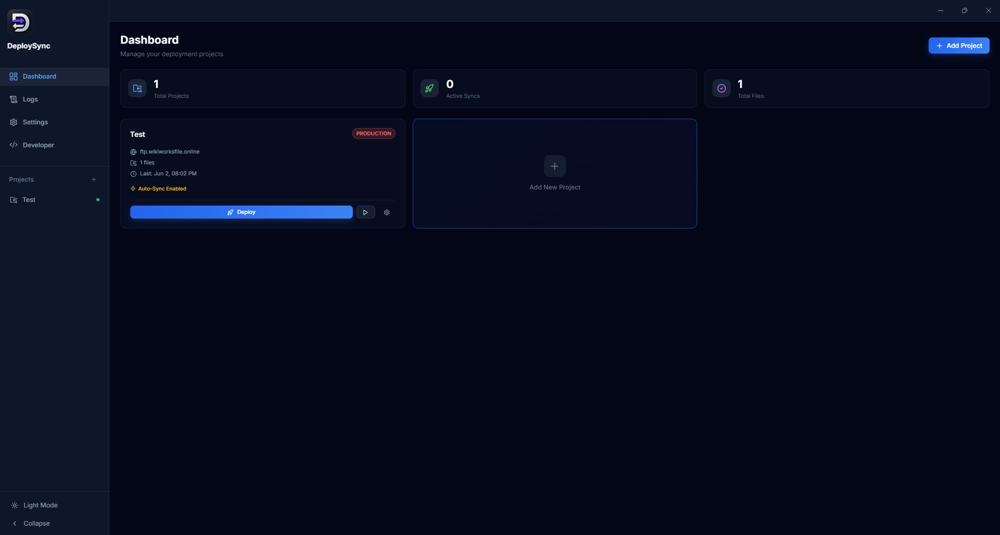
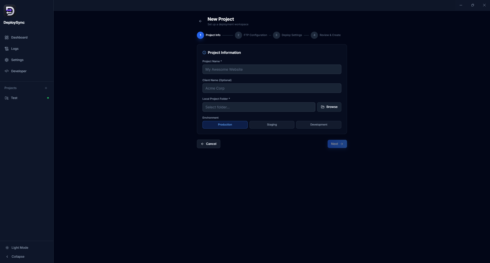
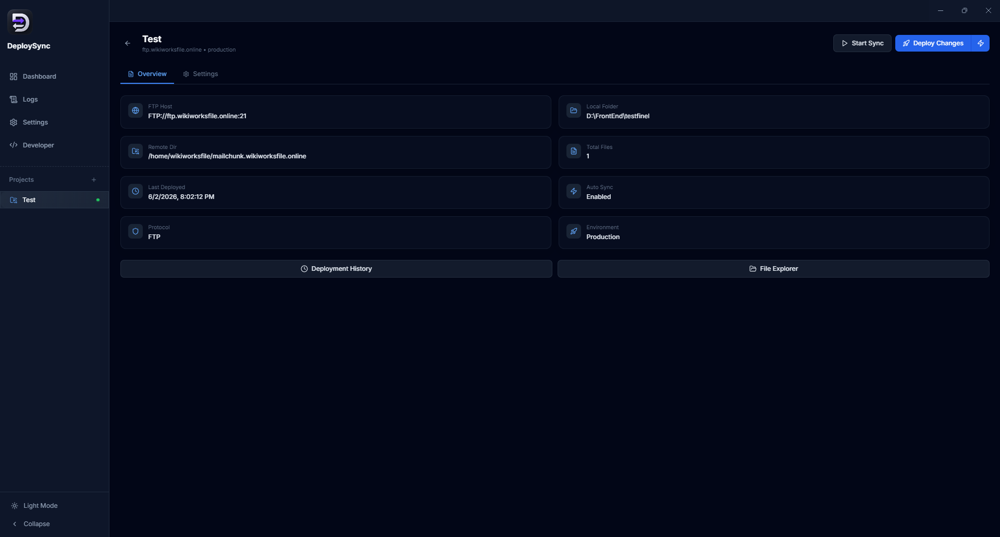

<div align="center">
  
  <h1 style="font-size: 28px; margin: 10px 0;">DeploySync</h1>
  <p>Smart deployment automation for FTP and SFTP servers.</p>
</div>

<p align="center">
  <a href="https://github.com/anuraghazra/github-readme-stats/actions">
    
  </a>
  <a href="https://github.com/anuraghazra/github-readme-stats/graphs/contributors">
    
  </a>
  <a href="https://codecov.io/gh/anuraghazra/github-readme-stats">
    
  </a>
  <a href="https://github.com/anuraghazra/github-readme-stats/issues">
    
  </a>
  <a href="https://github.com/anuraghazra/github-readme-stats/pulls">
    
  </a>
  <a href="https://securityscorecards.dev/viewer/?uri=github.com/anuraghazra/github-readme-stats">
    
  </a>
  <br />
  <br />
</p>

<p align="center">
  <a href="#all-demos">View Demo</a>
  ·
  <a href="https://github.com/anuraghazra/github-readme-stats/issues/new?assignees=&labels=bug&projects=&template=bug_report.yml">Report Bug</a>
  ·
  <a href="https://github.com/anuraghazra/github-readme-stats/issues/new?assignees=&labels=enhancement&projects=&template=feature_request.yml">Request Feature</a>
  ·
  <a href="https://github.com/anuraghazra/github-readme-stats/discussions/1770">FAQ</a>
  ·
  <a href="https://github.com/anuraghazra/github-readme-stats/discussions/new?category=q-a">Ask Question</a>
</p>

DeploySync is a desktop application that simplifies website deployment by detecting file changes and synchronizing only modified files, making deployments faster and more efficient.

## Features

- Incremental file synchronization
- FTP & SFTP support
- One-click deployment
- Hash-based change detection
- Secure credential storage
- Multi-project management
- Real-time deployment logs
- Live progress tracking

## Screenshots

### Dashboard


### New Project


### Deployment


## How It Works

```text
Local Project
    ↓
Change Detection
    ↓
Smart Sync Engine
    ↓
FTP / SFTP Server
    ↓
Deployment Complete
```

## Installation

1. Download the latest release.
2. Install the application.
3. Create a deployment project.
4. Configure your server.
5. Deploy.

## Built With

- Electron
- React
- TypeScript
- Tailwind CSS

## License

MIT License

## Support

If you find this project useful, consider giving it a ⭐ on GitHub.
