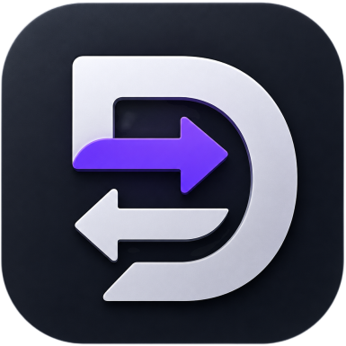

  
  <h1>DeploySync</h1>
  
<b>Smart deployment automation for FTP and SFTP servers</b>

  
  
  
  

 

  <a href="https://github.com/codesuab/deploysync/issues">Report Bug</a> ·
  <a href="https://github.com/codesuab/deploysync/issues">Request Feature</a> ·
  <a href="https://github.com/codesuab/deploysync/discussions">Discussions</a> ·
  <a href="https://github.com/codesuab/deploysync/discussions">Support</a>

 

> DeploySync is a desktop application that automates website deployment by detecting changed files and syncing only what is required. It improves speed, reduces bandwidth usage, and simplifies deployment workflows.

 

## Why DeploySync

Traditional FTP tools upload entire projects even when only a few files change.  
DeploySync solves this using intelligent change detection and incremental syncing.

 

## Features

- Smart incremental file synchronization
- FTP & SFTP support
- One-click deployment
- Hash-based change detection
- Secure credential storage
- Multi-project workspace
- Real-time deployment logs
- Live progress tracking

 

## How It Works

Local Project  
↓  
Change Detection  
↓  
Smart Sync Engine  
↓  
FTP / SFTP Server  
↓  
Deployment Complete

 

## Screenshots

<table>
  <tr>
    <td align="left">
      Dashboard 
      
    </td>
    <td align="left">
      New Project 
      
    </td>
    <td align="left">
      Deployment 
      
    </td>
  </tr>
</table>

 

## Tech Stack

- Electron
- React
- TypeScript
- Node.js
- Tailwind CSS

 

## Security

- Local encrypted credential storage
- Secure FTP & SFTP connections
- No external tracking or telemetry

 

## Use Cases

- Laravel / PHP deployment
- React / Next.js applications
- Static website hosting
- Freelance project delivery
- Agency deployment workflow

 

## Roadmap

- Git-based deployment integration
- CI/CD pipeline support
- Auto rollback system
- Cloud deployment profiles
- Team collaboration features

 

## Installation

1. Download latest release
2. Install application
3. Create project
4. Configure server
5. Deploy

 

## License

MIT License

 

## Support

If you find this project useful, consider giving it a ⭐ on GitHub.
